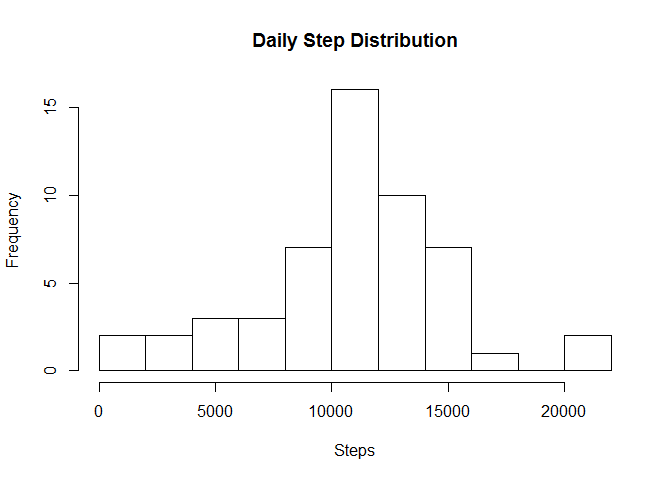
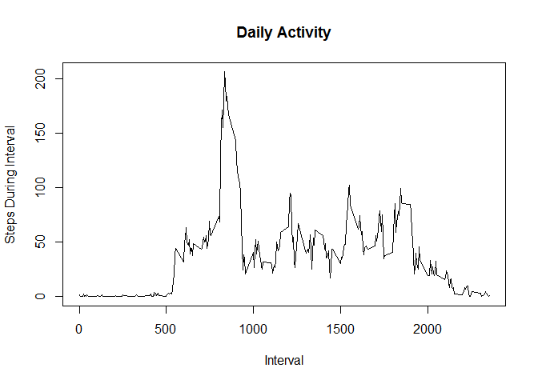
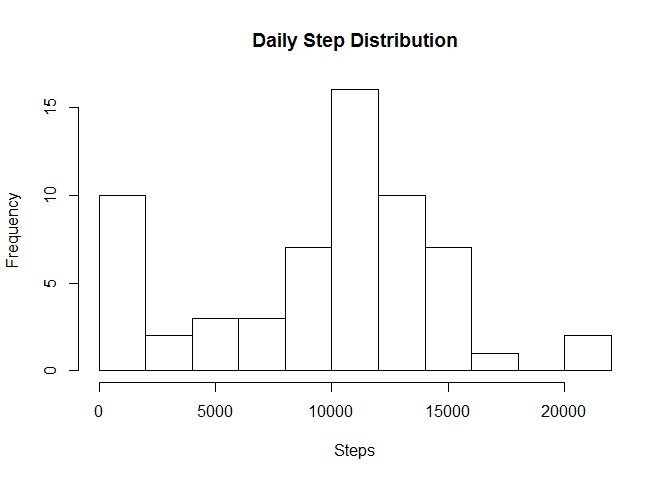
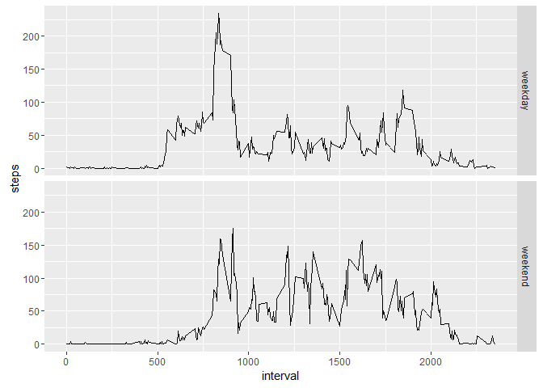

# Reproducible Research Project
Joel Martin  
April 5, 2016  


# Reproducible Research: Step Data Analysis
### Author: Joel Martin

## Introduction

We obtained a set of data consisting of steps per five-minute interval, collected throughout each day in October and November 2012. Our goal is to understand basic features of the data set and answer some basic questions using it. The analysis is described in this document.

## Processing

The data was obtained from [the course website](https://d396qusza40orc.cloudfront.net/repdata%2Fdata%2Factivity.zip) in a zip file and saved to the working directory, then loaded into R. 


```r
walkingdata <- read.csv("activity.csv", header = TRUE, stringsAsFactors = FALSE)
```

No further pre-processing was required.

## Daily Steps

We first used the dplyr package to summarize the data by day. 


```r
library(dplyr)
```

```
## 
## Attaching package: 'dplyr'
## 
## The following objects are masked from 'package:stats':
## 
##     filter, lag
## 
## The following objects are masked from 'package:base':
## 
##     intersect, setdiff, setequal, union
```

```r
dailydata <- walkingdata %>% group_by(date) %>% summarise(daily = sum(steps))
```

Next we generated a histogram to understand the distribution of the data. 


```r
hist(dailydata$daily, breaks = 10, main = "Daily Step Distribution", xlab = "Steps")
```

 

Finally we calculate a mean and median for the data (ignoring NA values).


```r
mean(dailydata$daily, na.rm = TRUE)
median(dailydata$daily, na.rm = TRUE)
```
Mean    |Median
------- |--------
10766.19|10765

## Daily Activity Pattern

In order to understand the pattern of daily activity, we generated a time series plot of the average number of steps taken for each five minute interval across all of the days. Again we use dplyr to group and summarize the data, this time by interval.


```r
intervaldata <- walkingdata %>% group_by(interval) %>% summarise(avg = mean(steps, na.rm = TRUE))
```

We then plotted this data as a time series.


```r
plot(x = intervaldata$interval, y = intervaldata$avg, type = "l", main = "Daily Activity", xlab = "Interval", ylab = "Steps During Interval")
```

 

Note that the "Interval" labels correspond to clock time (24 hour clock) rather than the total minutes. For example, the peak activity at approximately interval 900 corresponds to around 9am. We can determine this point exactly by sorting on avg. 


```r
intervaldatasort <- arrange(intervaldata, desc(avg))
intervaldatasort$interval[1]
```

```
## [1] 835
```

Thus the highest average activity occurs between 8:35am and 8:40am.

## Missing Values

The data set contains a significant number of NA values for steps.


```r
sum(is.na(walkingdata$steps))
```

```
## [1] 2304
```

We can impute these missing values by replacing all NAs with the value immediately preceeding it. 


```r
cleandata <- walkingdata
cleandata$steps[1] <- 0
for (i in (1:17568)) {
        if (is.na(cleandata$steps[i])) {
                cleandata$steps[i] <- cleandata$steps[i-1]
        }
}
sum(is.na(cleandata$steps))
```

```
## [1] 0
```

We wanted to compare this data with the original to see how much our imputation method has impacted it. We generated a histogram of the data


```r
cleandaily <- cleandata %>% group_by(date) %>% summarise(daily = sum(steps))
hist(cleandaily$daily, breaks = 10, main = "Daily Step Distribution", xlab = "Steps")
```

 

which shows that we've created eight days with zero (or very few) steps (previously there were two). This impacts the daily mean and median as well. 


```r
mean(cleandaily$daily, na.rm = TRUE)
```

```
## [1] 9354.23
```

```r
median(cleandaily$daily, na.rm = TRUE)
```

```
## [1] 10395
```

As we would expect, the median is not signficantly impacted, but the mean is over 1000 lower than the original data. An alternative method to mitigate this issue would be to exlude any data with all or mostly NA values, and then perform the imputation method on this new data set. 

## Weekdays vs. Weekends

It seems likely that people will have different activity patters on weekdays versus weekends. To explore this possibility, we classify the data as "weekday" (Monday-Friday) and "weekend" (Saturday and Sunday) and then calculating interval averages for the two categories. 


```r
datedata <- walkingdata %>% 
        mutate(date = as.Date(date)) %>% 
        mutate(weekday = weekdays(date)) %>% 
        mutate(type = ifelse(weekday == "Saturday" | weekday == "Sunday", "weekend","weekday"))
        
dateintervals <- aggregate(steps~interval+type, data = datedata, FUN = function (x) {mean(x,na.rm=T)})
```

We can then plot the resulting data in a time series, this time as a two panel plot instead of just one. 


```r
library(ggplot2)
```


```r
qplot(interval, steps, data = dateintervals, geom = "line", group = type) + facet_grid(type~.)
```

 

We can see that the large spike in the morning is not present on the weekend, likely indicating that this individual typically walks before or to work. 


